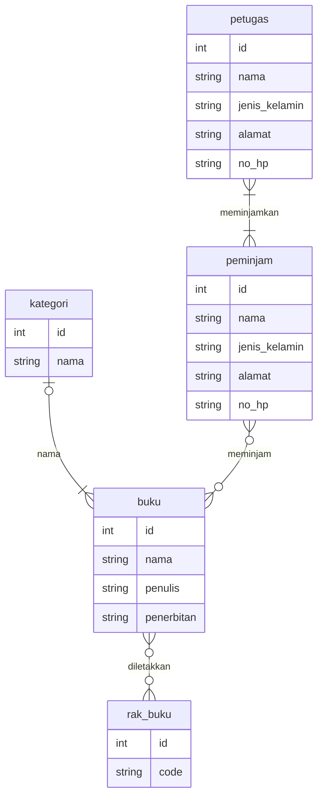

```mermaid
erDiagram
    buku{
        int id
        string nama
        string penulis
        string penerbitan
    }
    kategori{
        int id
        string nama
    }
    rak_buku{
        int id
        string code
    }
    petugas{
        int id
        string nama
        string jenis_kelamin
        string alamat
        string no_hp
    }
    peminjam{
        int id
        string nama
        string jenis_kelamin
        string alamat
        string no_hp
    }

buku}o--o{rak_buku : diletakkan
kategori|o--|{buku : nama
peminjam}o--o{buku : meminjam
petugas}|--|{peminjam : meminjamkan
```