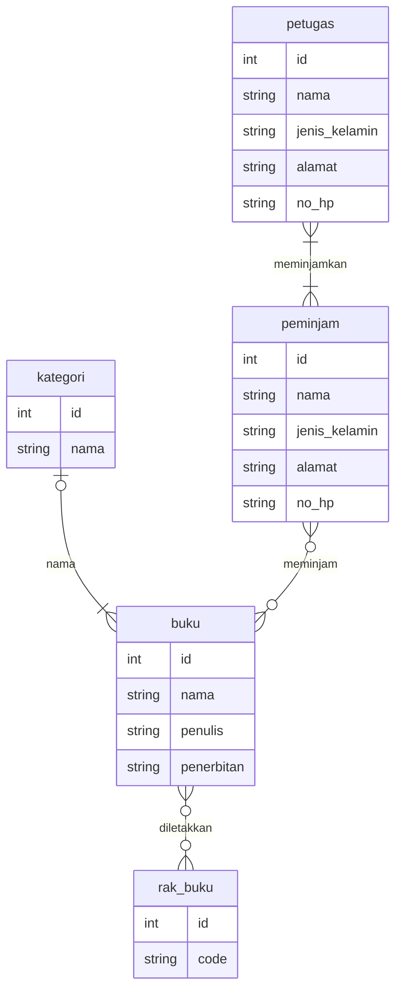

# ERD Sistem Manajemen Perpustakaan

Proyek ini berisi **Entity Relationship Diagram (ERD)** untuk sistem manajemen perpustakaan. Diagram ini menggambarkan hubungan antar entitas utama seperti **buku**, **kategori**, **rak buku**, **petugas**, dan **peminjam**.

---

## Struktur Entitas

### 1. **Buku**
| Kolom | Tipe Data | Keterangan |
|-------|------------|------------|
| id | int | Primary Key |
| nama | string | Nama buku |
| penulis | string | Nama penulis buku |
| penerbitan | string | Tahun atau nama penerbit |

### 2. **Kategori**
| Kolom | Tipe Data | Keterangan |
|-------|------------|------------|
| id | int | Primary Key |
| nama | string | Nama kategori buku |

### 3. **Rak Buku**
| Kolom | Tipe Data | Keterangan |
|-------|------------|------------|
| id | int | Primary Key |
| code | string | Kode lokasi rak buku |

### 4. **Petugas**
| Kolom | Tipe Data | Keterangan |
|-------|------------|------------|
| id | int | Primary Key |
| nama | string | Nama petugas |
| jenis_kelamin | string | Jenis kelamin petugas |
| alamat | string | Alamat petugas |
| no_hp | string | Nomor telepon petugas |

### 5. **Peminjam**
| Kolom | Tipe Data | Keterangan |
|-------|------------|------------|
| id | int | Primary Key |
| nama | string | Nama peminjam |
| jenis_kelamin | string | Jenis kelamin peminjam |
| alamat | string | Alamat peminjam |
| no_hp | string | Nomor telepon peminjam |

---

## Hubungan Antar Entitas

- **Kategori** memiliki banyak **Buku**  
  `kategori |o--|{ buku : nama`

- **Buku** diletakkan di **Rak Buku**  
  `buku }o--o{ rak_buku : diletakkan`

- **Peminjam** dapat meminjam banyak **Buku**  
  `peminjam }o--o{ buku : meminjam`

- **Petugas** meminjamkan kepada **Peminjam**  
  `petugas |--|{ peminjam : meminjamkan`

---

## Diagram ERD

## Keterangan

Diagram ini dirancang untuk membantu perancangan database sistem perpustakaan, yang dapat diimplementasikan menggunakan:

- MySQL
- PostgreSQL
- SQLite
- atau sistem basis data relasional lainnya.
