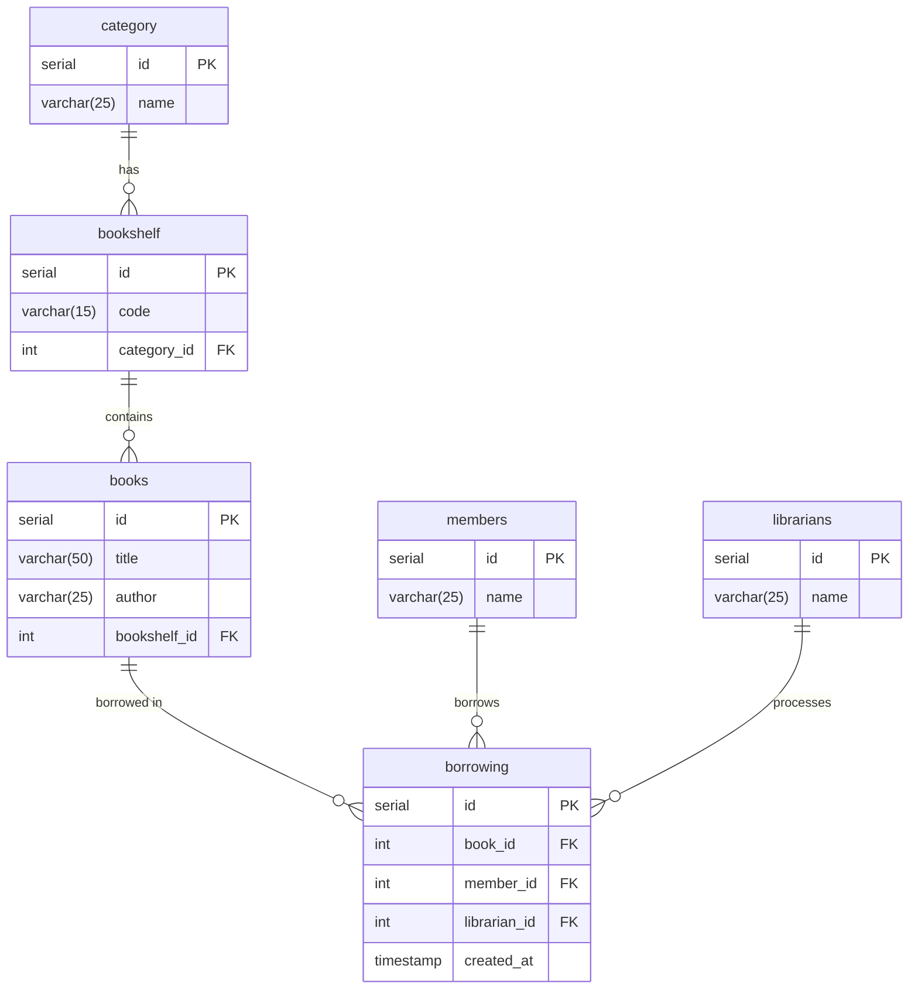

# Library Management System

Sistem Manajemen Perpustakaan ini dirancang untuk mengelola data buku, kategori buku, rak buku, anggota perpustakaan, petugas, serta proses peminjaman buku. Sistem ini mempermudah pencatatan dan pelacakan buku yang dipinjam oleh anggota serta siapa petugas yang memproses transaksi tersebut.

## Diagram ERD

## Struktur folder
| Tabel          | Deskripsi                                             |
| -------------- | ----------------------------------------------------- |
| **category**   | Menyimpan daftar kategori buku                        |
| **bookshelf**  | Menyimpan kode rak buku dan mengacu pada kategori     |
| **books**      | Menyimpan informasi buku serta lokasi rak penyimpanan |
| **librarians** | Menyimpan data petugas perpustakaan                   |
| **members**    | Menyimpan data anggota perpustakaan                   |
| **borrowing**  | Mencatat transaksi peminjaman buku                    |

## Relasi Antar Tabel

- Satu kategori dapat memiliki banyak rak buku.
- Satu rak buku dapat berisi banyak buku.
- Satu buku dapat dipinjam dalam banyak transaksi peminjaman.
- Satu anggota dapat melakukan banyak transaksi peminjaman.
- Satu petugas dapat memproses banyak transaksi peminjaman.

## Tujuan Sistem

- Mempermudah pengelolaan data buku dan kategori.
- Melacak status peminjaman buku oleh anggota.
- Mencatat siapa petugas yang memproses peminjaman.

## Fitur yang Dapat Dikembangkan

- Sistem login untuk petugas.
- Batas waktu peminjaman & denda keterlambatan.
- Laporan statistik peminjaman per bulan.

## Keterangan

Diagram ini dirancang untuk membantu perancangan database sistem perpustakaan, yang dapat diimplementasikan menggunakan:

- MySQL
- PostgreSQL
- SQLite
- atau sistem basis data relasional lainnya.
